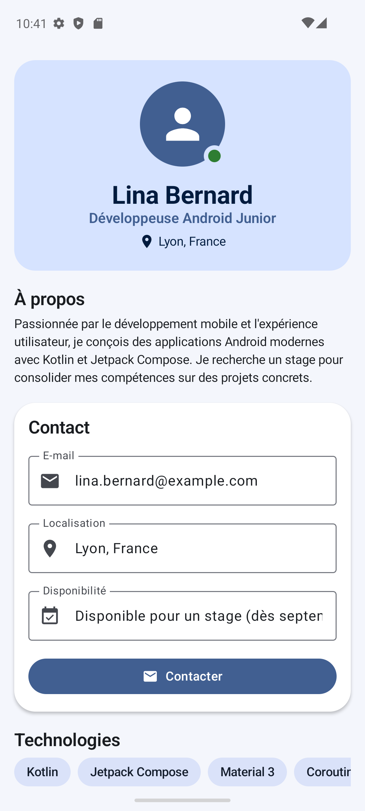
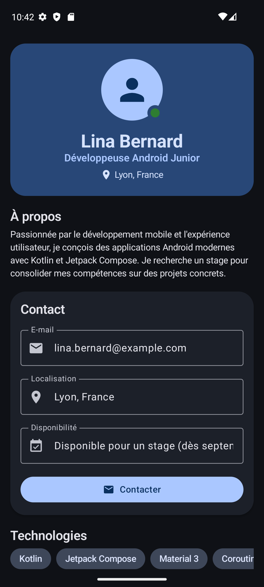

# Profil Développeur — Jetpack Compose

---

## 1. Description de l'application

L'application présente le profil (fictif) de **Lina Bernard**, *Développeuse Android
Junior* en recherche de stage. Toutes les données sont **locales**, écrites directement
en Kotlin (`sampleProfile()`), sans aucune source distante.

L'écran unique, défilable, affiche : le **nom** et le **titre / rôle**, un **avatar**
placeholder avec badge « disponible », une **description** (« À propos »), une **zone de
contact** (e-mail, localisation, disponibilité) en champs *lecture seule*, une **action
utilisateur** (bouton *Contacter*), et des listes de **technologies**, **compétences**,
**projets** et **expériences**.

Le clic sur le bouton appelle un **callback vide** (`onContactClick`) : pas de vraie
action, conformément à la consigne.

---

## 2. Composants Compose utilisés

| Composant | Où / pourquoi |
|-----------|---------------|
| `Text` | Titres, descriptions, libellés, informations |
| `Button` | Action utilisateur « Contacter » |
| `Icon` | Icônes de section et d'information (`Email`, `LocationOn`, `Work`, `Code`, `Star`, `EventAvailable`) |
| `Image` | Avatar placeholder (drawable vectoriel teinté via `ColorFilter`) |
| `Card` | Regroupement des infos (contact, compétences, projets) |
| `OutlinedTextField` (**lecture seule**) | Affichage structuré d'e-mail, localisation, disponibilité |
| `Surface` | Bandeau d'en-tête et puces de technologies |
| `Scaffold` | Structure de l'écran (edge-to-edge) |

---

## 3. Layouts utilisés

| Layout | Rôle |
|--------|------|
| `Column` | Structure verticale de l'écran et des cartes |
| `Row` | Alignement d'éléments sur une même ligne (icône + texte) |
| `Box` | Zone superposée : avatar **+** badge « en ligne » par-dessus |
| `Spacer` | Gestion des espacements |
| `Surface` | Zone visuelle cohérente avec le thème (en-tête, puces) |
| `LazyColumn` | Liste verticale principale (écran défilable) |
| `LazyRow` | Listes horizontales (technologies, étiquettes de projet) |

---

## 4. Liste affichée avec `LazyColumn` / `LazyRow`

L'écran entier est une **`LazyColumn`** (`DeveloperProfileScreen`) : elle empile les
sections dans des `item { }` (en-tête, à propos, contact, titres de section) puis affiche
les collections avec `items(...)`, chaque élément étant rendu par un **composable
réutilisable** :

- `items(profile.skills)` → **`SkillCard`** (nom de la compétence) ;
- `items(profile.projects)` → **`ProjectCard`** (nom, description, étiquettes) ;
- `items(profile.experiences)` → **`ExperienceItem`** (rôle, entreprise, période).

Deux **`LazyRow`** horizontales complètent l'ensemble :

- la section *Technologies* → **`TechnologyChip`** pour chaque technologie ;
- les étiquettes de chaque `ProjectCard` → réutilisation du même `TechnologyChip`.

Chaque `items(...)` utilise une **`key`** stable (nom de la compétence, du projet, etc.)
pour aider Compose à recomposer efficacement.

---

## 5. Choix de thème (Material Design 3)

Le thème est défini dans `ui/theme/Theme.kt` via `ProfilDevTheme`, qui alimente
`MaterialTheme` avec trois briques personnalisées :

- **`colorScheme`** — une palette **bleu / indigo** professionnelle, déclinée en
  `lightColorScheme` **et** `darkColorScheme`. Le fond (`background`) et les cartes
  (`surface`) sont volontairement distincts pour que les `Card` ressortent. La bascule
  clair / sombre suit le système via `isSystemInDarkTheme()`, et peut être forcée dans les
  previews (`darkTheme = true/false`).
- **`typography`** — une hiérarchie lisible (`headlineMedium`, `titleLarge/Medium`,
  `bodyMedium/Small`, `labelLarge/Medium`) réutilisée partout via
  `MaterialTheme.typography`.
- **`shapes`** — une échelle de coins arrondis personnalisée (`small` → `extraLarge`), dont
  `medium`, `large` et `extraLarge` sont appliqués aux cartes, surfaces et puces via
  `MaterialTheme.shapes`.

Les composables s'appuient sur `MaterialTheme.colorScheme / typography / shapes` plutôt
que sur des valeurs codées « en dur » (seule exception : le point vert « disponible » du
badge, un accent de statut fixe). Le rendu reste ainsi **cohérent et automatiquement
adapté** au mode clair comme au mode sombre.

---

## 6. Capture d'écran

| Thème clair | Thème sombre |
|:---:|:---:|
|  |  |

---

## 7. Quelles notions du chapitre *Compose UI* ai-je réutilisées ?

Les **six notions** du chapitre, telles qu'énoncées dans le sujet :

- **Composants fondamentaux** — `Text`, `Button`, `Icon`, `Image`, `Card` et
  `OutlinedTextField` en lecture seule.
- **Layouts Compose** — `Column`, `Row`, `Box` (avatar + badge superposé), `Spacer`,
  `Surface`.
- **Listes modernes** — `LazyColumn` (écran) et `LazyRow` (technologies, étiquettes) avec
  `items` et `key`.
- **Cartes réutilisables** — `SkillCard`, `ProjectCard`, `ExperienceItem`,
  `TechnologyChip`.
- **Material Design 3** — `MaterialTheme.colorScheme`, `typography` et `shapes`.
- **Thème clair / sombre** — `lightColorScheme` **et** `darkColorScheme`, avec bascule
  système via `isSystemInDarkTheme()`.
